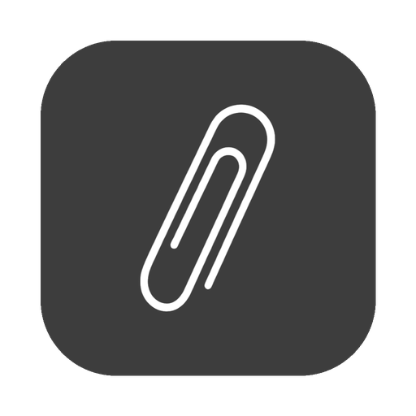
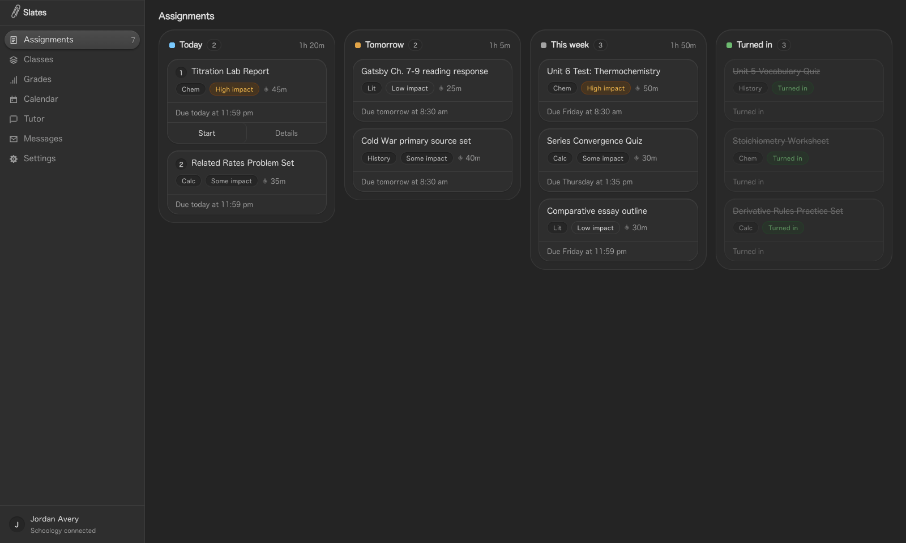
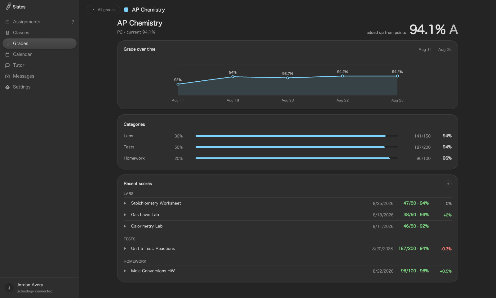
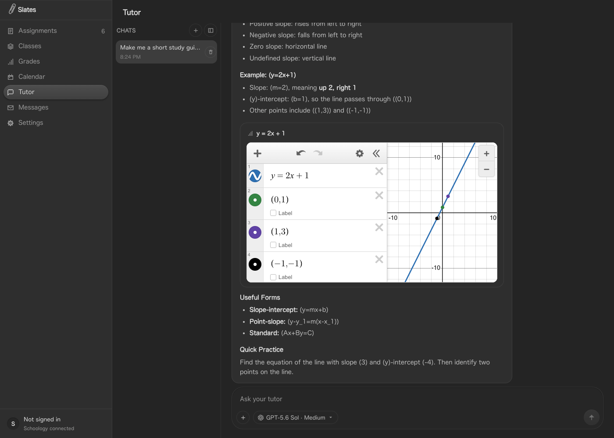
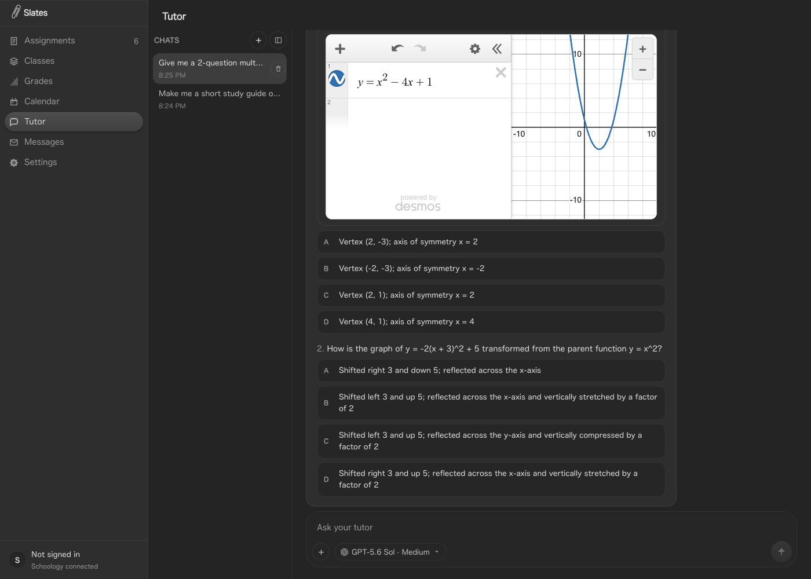

<div align="center">



# SLATES

### Schoology, rebuilt as a workspace.

**A board that plans your night. A gradebook that tells the truth. A tutor that actually read the assignment — and a college counselor that remembers you.**

[](LICENSE)
[](https://nextjs.org)
[](web/tsconfig.json)
[](desktop)
[](https://developers.schoology.com)

<br>



</div>

<br>

Schoology is a filing cabinet. Every class is a different drawer, every due date is a click deep, and the homepage lies about what's actually due tonight.

**Slates is the desk.** One dark, fast, native-feeling board that pulls your real assignments, real grades, and real due dates out of Schoology and lays them flat — plus the one number the LMS was never built to track: **the hours you actually burned.**

No more twenty tabs. No more "I thought I turned that in."

<br>

## Watch

<div align="center">

<a href="https://youtu.be/Uy-wxAlgRG0">
  
</a>

### [▶&nbsp; Watch the launch video](https://youtu.be/Uy-wxAlgRG0)

</div>

In a hurry? The [48-second demo](https://github.com/smaranz/slates/blob/main/.github/readme/slates-demo.mp4) goes straight to the board.

## Download

| | |
| --- | --- |
| **macOS** (Apple Silicon) | [Download the `.dmg`](https://github.com/smaranz/slates/releases/latest) |
| **Windows** (x64) | [Download the installer](https://github.com/smaranz/slates/releases/latest) |

Both are unsigned, because notarising a Mac app and signing a Windows one cost
$99/year and $200-odd/year respectively and this is a student project. That has
a visible consequence the first time you open it:

- **macOS** — right-click the app and choose Open. Double-clicking reports that
  Slates "is damaged and can't be opened", which is Gatekeeper's phrasing for
  "not notarised" and not a statement about the download.
- **Windows** — SmartScreen will interrupt. More info → Run anyway.

Neither shows anything until you give it a Schoology API key; Settings says
where to generate one. Prefer to run from source? [Skip to Run it](#run-it).

<br>

## Everything on one board

<table>
<tr>
<td width="50%" valign="top">

**📋 Board**
Tonight / tomorrow / this week / turned in. Every card carries its real impact, a time estimate, and one honest due date — dragged into place by hand outranks anything auto-sorted.

**📊 Grades**
Live category math, not Schoology's cached percentage. Type in a hypothetical score for any real assignment and watch the projected grade move *before* the test happens, not after.

**📅 Calendar**
Due dates as they exist on the assignment page, not as the homepage implied three weeks ago.

</td>
<td width="50%" valign="top">

**⏱️ Timer**
Start it, close the laptop, come back — it's still counting. The one metric no LMS on Earth will ever show you: where your hours actually went.

**✉️ Messages**
The inbox, with none of the rest of the LMS dragged in behind it.

**🖇️ Live overlay**
Quizzes and Drive handoffs stay on the *real* Schoology page — Slates overlays the tracker on top. We don't reimplement a server-side timer and gamble your grade on it.

</td>
</tr>
</table>

<div align="center">

</div>

<br>

## The tutor doesn't just chat

Ask it a question and it answers in four sentences, like a person who respects your time. Ask it for *work*, and it stops talking and starts building — right there in the thread, not as a promise to "here's an outline you could use."

<table>
<tr>
<td width="50%" valign="top" align="center">

<br><sub><b>A study guide it wrote, with a graph it drew — not described.</b></sub>
</td>
<td width="50%" valign="top" align="center">

<br><sub><b>Practice questions from the actual unit, graded on the spot.</b></sub>
</td>
</tr>
</table>

- **Study guides & documents** — full markdown, copy or download as `.md`, not crammed into a chat bubble.
- **Live graphs** — a real, pannable Desmos calculator embedded inline, in chat, inside a study guide, or attached to a question. Asked for a parabola, you get a parabola you can drag, not a paragraph describing one.
- **Practice tests** — multiple choice with instant grading and an explanation, free-response with a rubric and on-demand AI feedback on *your* answer.
- **Narrated teaching videos** — script, voice, and visuals composed into an actual MP4 for a concept worth walking through slowly.
- **Board actions** — "mark that done," "move it to tonight," "start the timer" — said in plain English, executed on the real board.
- **Nine model families** — GPT, Claude, Grok, Composer, DeepSeek, GLM, Qwen, Gemini, MiniMax. Attach a photo of the handout. Every thread persists — leave to check an assignment, the conversation is exactly where you left it.

<br>

## Two halves

Slates opens on a choice, because the year has two halves and they share nothing but the student.

**School** is everything above: the board, the gradebook, the tutor. The work in front of you.

**Counselor** is an agentic AI college counselor — not a chat window with a prompt on it.

- **It reads a real library.** Point it at a folder of counseling material — guides, workshops, strategy documents — and `npm run counselor:ingest` chunks, embeds, and indexes the lot into `~/.slates/knowledge/`. Every "how do I…" question is answered out of that first, cited by document name. Ask how to open a *why us* essay and it comes back with the house view, not the internet's.
- **It researches what it can't know.** Deadlines, costs, test-optional policies, admit rates — looked up on the web with the source named, never recalled from training data. Twelve load-bearing facts (SAT format, what ED binds you to, when FAFSA opens) are hard-coded and beat everything.
- **It remembers.** Goals, worries, money constraints, the teacher writing your recommendation. Saved as you say them and carried into every later conversation, voice included. You can read everything it holds and delete any of it.
- **It has a verdict.** "Apply ED to Michigan." "Retake once, then stop." "Cut two reaches." It's instructed at length not to hand you a balanced list of options and call that advice.
- **It acts on your real record.** Thirty tools over your profile, next steps, documents, check-ins, college list, and application tracker — so "I'll add that" means a row appeared. When it needs a decision from you it opens a short form instead of burying four questions in a paragraph.
- **Documents you keep.** Activity lists, brag sheets, deadline checklists, essay outlines, draft emails. Markdown, editable, downloadable. It will not write your personal statement, and says why.
- **Talk to it.** A live call on `gpt-realtime-2.1-mini`, peer-to-peer from your browser to OpenAI over WebRTC — audio never touches Slates, which only mints the one-call key. It searches the same library, saves memories, and records scores mid-sentence.
- **Honest odds.** A logistic model over each school's acceptance rate, your position in its middle 50%, rigor, activities, first-gen status, and round — always a band, never a single false-precision number.

The counselor's whole record — profile, memories, documents, applications — lives in `localStorage` on your machine, and the library index in `~/.slates/`. No account, no database, nothing to sign into.

```bash
# Index a counseling library so the counselor answers from it
cd web && npm run counselor:ingest -- ~/path/to/your/guides
```

The library itself is never copied into this repo — it's somebody's professional material, and only the index lands on your machine.

<br>

## How it's built

```
┌──────────────┐      ┌────────────────┐      ┌──────────────────┐
│  Slates UI   │─────▶│  Slates server │─────▶│  Schoology REST  │
│  Next.js 16  │      │  OAuth 1.0a    │      │  api.schoology   │
└──────────────┘      └────────────────┘      └──────────────────┘
       │
       └── desktop shell (Electron) starts it. One icon. Quit kills everything.
```

Your key and secret stay on your machine, in `web/.env.local`, and are read
only by the server — the browser never sees them and Slates has no backend of
its own to send them to. Requests are signed per-call with HMAC-SHA1, which is
the only authentication Schoology's API accepts.

| Path | What lives there |
| --- | --- |
| [`web/`](web) | The Next.js 16 portal — board, grades, tutor, everything you look at |
| [`web/lib/schoology/`](web/lib/schoology) | The API client: request signing, endpoints, and the snapshot it builds |
| [`desktop/`](desktop) | Electron shell — one process tree, one dock icon, one quit |
| [`mobile/`](mobile) | Capacitor shell for iPhone and Android |

<br>

## What it can and can't do

Slates reads through Schoology's official API, and that API is mostly a
read interface. Being straight about the edges:

| Works | Doesn't |
| --- | --- |
| Board, calendar, and every due date | Handing work in — there is no student-scoped endpoint that writes to a dropbox |
| Live category math and what-if grades | Taking a quiz or assessment inside Slates |
| Class materials, folder by folder | Opening a teacher's file in-app (the API lists it but won't serve the bytes) |
| Reading your inbox | Sending or replying — addressing a message needs directory access a student key doesn't get |
| The tutor and the college counselor in full | |

Everything in the right-hand column opens on Schoology instead, one tap from
the card it belongs to. Nothing is a dead button.

<br>

## Run it

```bash
git clone https://github.com/smaranz/slates.git
cd slates/web

cp .env.example .env.local   # add SCHOOLOGY_KEY and SCHOOLOGY_SECRET
npm install
npm run dev                  # http://localhost:3000
```

Get the key pair from `https://<your-district>.schoology.com/api` while signed
in — it takes about ten seconds. Then open the portal and hit **Settings →
Sync now**.

If that page tells you API access is disabled, your district has switched it
off and only an administrator can switch it back on. Slates has nothing to
read until they do.

### Desktop app

```bash
cd desktop
npm install
npm run dev    # attaches to the Next server you already started
npm run dist   # packaged build (macOS arm64)
```

### Mobile app

The `mobile/` project is a Capacitor shell for iPhone and Android. It uses a
phone-specific navigation and layout, while loading the same Next.js server so
route handlers, AI backends, and Schoology proxying continue to work.

```bash
cd web
npm run dev:mobile           # exposes the portal to your trusted LAN

cd ../mobile
npm install
cp .env.example .env         # set the host computer's reachable URL
npm run check:server
npm run sync
npm run open:ios             # or npm run open:android
```

The phone talks to the Next.js server rather than to Schoology directly, so
keep the portal running on the trusted computer you point it at — that is
where the API key lives and where the tutor's model calls are made. Full setup
and signing notes in [`mobile/README.md`](mobile/README.md).

### Keys

`SCHOOLOGY_KEY` and `SCHOOLOGY_SECRET` are the two that matter — without them
there is nothing to show. Every other key is optional in isolation, and the
feature behind it degrades to "not configured" until you add it.

| Variable | Unlocks |
| --- | --- |
| `SCHOOLOGY_KEY` + `SCHOOLOGY_SECRET` | Your actual classes, assignments, and grades |
| `OPENAI_API_KEY` | GPT tutor models + assignment time estimates |
| `OPENROUTER_API_KEY` | DeepSeek, GLM, Qwen, Gemini, MiniMax |
| `NEXT_PUBLIC_DESMOS_API_KEY` | Live, interactive graphs from the tutor |
| `ELEVENLABS_API_KEY` | Narration for AI-generated teaching videos |
| `OPENAI_API_KEY` | Also powers the counselor, its library index, and voice calls |
| Claude | `claude auth login` — no key lives in the env |
| Grok / Composer | `cd web && npm run cursor:login` |

Full reference: [`web/.env.example`](web/.env.example).

<br>

## Rules of the road

This reads **your own** Schoology account through the API your district
issued you a key for, and nobody else's. Keep it personal and single-account,
and don't point it at an account that isn't yours.

<br>

<div align="center">

MIT. Take it, fork it, make it meaner.


</div>
