<div align="center">

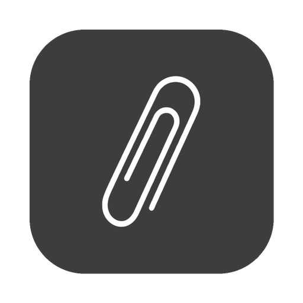

# Slates

### The personal operating system.

One app with a room for each part of your life, from your classes to the code you write.<br>
It runs on your own computer, it's open source, and every room already knows your work.

<br>

<a href="https://github.com/smaranz/slates/releases/download/v0.1.0/Slates-0.1.0-arm64.dmg"></a>&nbsp;<a href="https://github.com/smaranz/slates/releases/download/v0.1.0/Slates.Setup.0.1.0.exe"></a>&nbsp;<a href="https://slates6767.vercel.app"></a>

[](https://github.com/smaranz/slates/releases/latest) [](LICENSE) [](#get-started) [](https://nextjs.org) [](web/tsconfig.json)

<br>

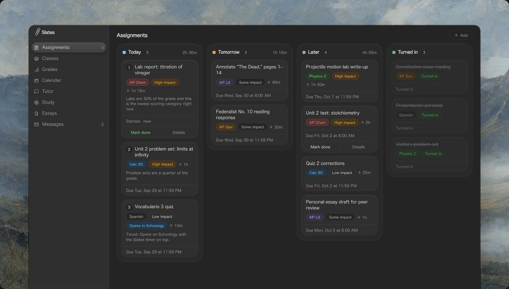

</div>

<br>

Schoology is a filing cabinet. Every class is a different drawer, every due date is a click deep, and the homepage is wrong about what's due tonight. **Slates is the desk.**

It started as a better board for homework and grew into a personal operating system: a launcher of rooms that each do one part of your life properly, all running on your machine and all reading the same record. The tutor has read the assignment you're stuck on. Grades knows what Friday's test is worth. The board knows how long tonight will take, and it counts the hours you actually spend.

<p align="center">
  <a href="#rooms">Rooms</a> ·
  <a href="#watch">Watch</a> ·
  <a href="#school">School</a> ·
  <a href="#study-studio">Study Studio</a> ·
  <a href="#for-the-nights-you-build">Builders</a> ·
  <a href="#being-built">Being built</a> ·
  <a href="#how-it-works">How it works</a> ·
  <a href="#get-started">Get started</a> ·
  <a href="#privacy">Privacy</a>
</p>

<br>

## Rooms

Slates opens on a launcher, like a home screen. Each room is its own app, and you can switch off the ones you don't use.

| Room | What it does | Status |
| --- | --- | --- |
| **School** | Assignments, grades, calendar, messages, and a tutor that has read the work |  |
| **Study Studio** | A study set for every test on your board, built from what your teacher posted |  |
| **UI Library** | More than 1,300 components from nine libraries, each with a live preview and its source |  |
| **AI Usage** | Every coding agent and account on your computer, with what each request would cost |  |
| **Slates MCP server** | Hands coding agents your UI components |  |
| **Mobile app** | Your rooms on your phone, connected to Slates on your computer |  |
| **Health** | Calories and macros from a photo of your plate, weight, and your F45 studio's workouts and classes |  |
| **Counselor** | Your college list, applications, and essays, with a counselor that remembers you |  |
| **Media Gen Studio** | Images, video, voice, sound, and music with ElevenLabs |  |
| **Agent** | AI teammates that work on your PC |  |
| **Notification Hub** | Work, personal, and school email in one view |  |
| **Calendar** | Your whole schedule, beyond school deadlines |  |
| **Hackathon Planner** | Winning ideas, research, a plan to win, and a prompt ready for a coding agent |  |
| **Hosting** | Vercel-style hosting for what you build |  |
| **Backend** | Supabase-style databases and backends, next to your hosting |  |
| **Agent power** | Keeps your laptop awake while agents run, and lets it sleep when they stop |  |

<sub>Screenshots in this README show a sample student and sample data.</sub>

<br>

## Watch

<div align="center">

<a href="https://youtu.be/Uy-wxAlgRG0">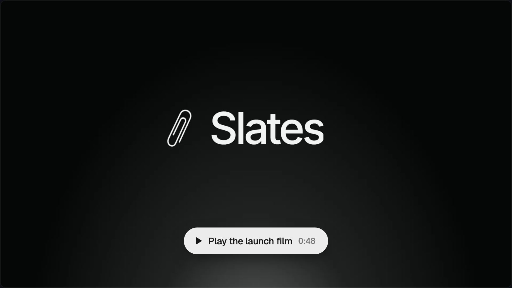</a>

**[Watch the launch film](https://youtu.be/Uy-wxAlgRG0)** · 48 seconds · or play it [on the website](https://slates6767.vercel.app/#film)

</div>

<br>

## School

The School room reads every class for you and lays the week out as one board. There's nothing to copy in, and it keeps itself up to date.

<table>
<tr>
<td width="50%" valign="top">

**The board.** Today, Tomorrow, Later, and Turned in. Every card carries what it's worth, roughly how long it takes, and one honest due date, so tonight has an order.

**Your plan wins.** Drag a card to another day and it stays there, even when Schoology updates.

**A timer that keeps counting.** Start it, close the laptop, come back. The time lands on the assignment, and Slates tracks the one number no LMS does: the hours you actually spent.

</td>
<td width="50%" valign="top">

**Grades that tell the truth.** Live category math instead of a cached percentage. Type a what-if score for any real assignment and watch the projected grade move before the test, not after.

**Calendar, classes, and messages.** Due dates as they are on the assignment page, every class's materials, and the inbox without the rest of the LMS behind it.

**Quizzes stay on Schoology.** Timed assessments open on the real page with the Slates timer on top. Slates never reimplements a timer and gambles your grade on it.

</td>
</tr>
</table>

<div align="center">
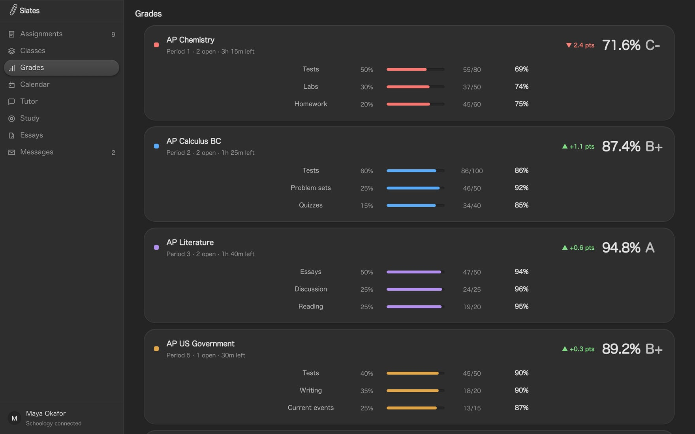
</div>

### The tutor has read the assignment

Mention any assignment with `@` and the tutor reads it, its handouts, and its attachments before it answers. Ask a question and you get a few sentences. Ask for work and it builds it, right in the thread.

<table>
<tr>
<td width="50%" valign="top" align="center">
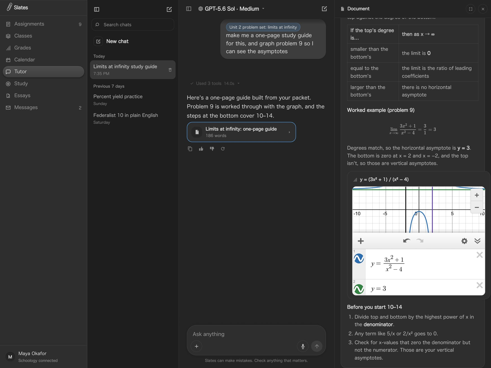
<br><sub><b>A study guide it wrote, with a graph you can pan and zoom.</b></sub>
</td>
<td width="50%" valign="top" align="center">
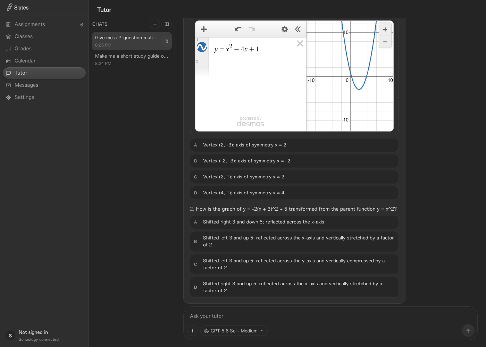
<br><sub><b>Practice from the actual unit, graded on the spot.</b></sub>
</td>
</tr>
</table>

- **Study guides and documents** in full Markdown, ready to copy or download.
- **Live Desmos graphs** inline, in a guide, or attached to a question. Ask for a parabola and you get one you can drag.
- **Practice tests** with instant grading and explanations, plus free-response questions with a rubric and feedback on your answer.
- **Narrated lesson videos**: a script, a voice, and visuals rendered into an MP4 for the concept worth walking through slowly.
- **Board actions** in plain English: "mark that done," "move it to tonight," "start the timer."
- **Nine model families**: GPT, Claude, Grok, Composer, DeepSeek, GLM, Qwen, Gemini, and MiniMax, on your own keys or the Claude and Cursor sign-ins you already have. Every thread persists.

<br>

## Study Studio

Slates already knows the test exists, what the teacher wrote about it, what was handed out with it, and how you've been scoring in that class. So Study Studio never asks what you want to study. It lists the tests you actually have and builds a module for the one you pick: what the test covers, a short plan with the time each step takes, practice questions, and the topics your gradebook says are weak, each with the grade it came from.

<div align="center">
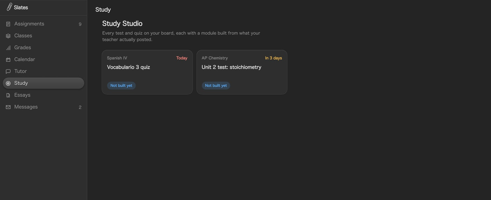
</div>

A rebuild is in progress that reads the unit's own Materials in Schoology (its folders, slides, notes, Pages, and the Google Docs and Slides teachers post by link) and writes a study guide, flashcards, and practice from them, with a study agent that can also research the web.

<br>

## For the nights you build

If you write code, Slates keeps your component libraries and your AI spending in the same place as everything else.

<table>
<tr>
<td width="50%" valign="top">

### UI Library

More than 1,300 components from shadcn/ui, Tailark, Aceternity UI, Spectrum UI, beUI, Great UI, Kibo UI, Beautiful UI, and Rare UI, on one searchable shelf. Each opens with a live preview, its full source, and the install command.

</td>
<td width="50%" valign="top">

### AI Usage

Claude Code, Codex, Gemini CLI, and opencode, read from their own logs on your computer and priced at API rates. See every account's plan limits, and what a subscription's tokens would have cost, per account and per request.

</td>
</tr>
<tr>
<td width="50%" valign="top">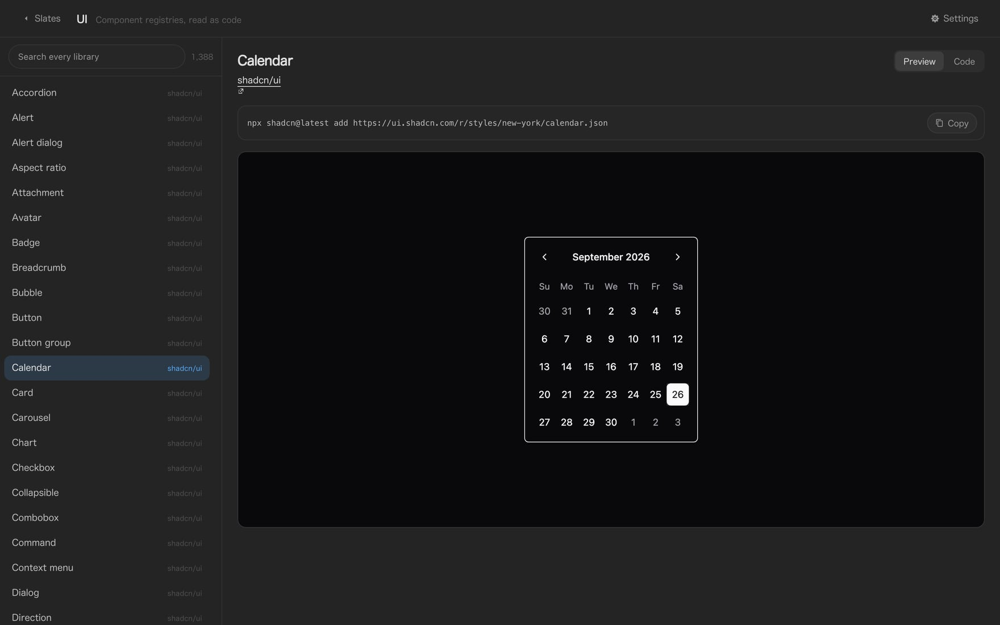</td>
<td width="50%" valign="top">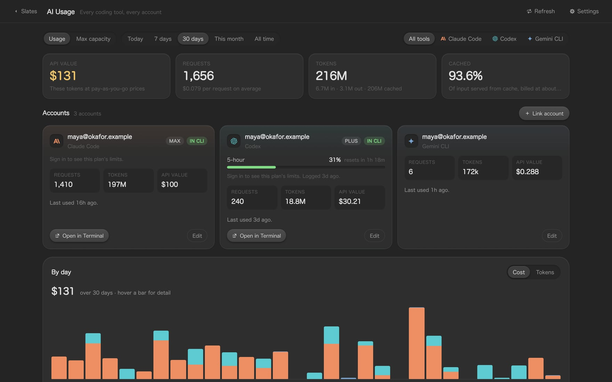</td>
</tr>
</table>

### The Slates MCP server

The same shelf, served to coding agents over MCP, so an agent can find a component, read its source and dependencies, and install it without you copying anything across.

```bash
claude mcp add slates-ui -- npx tsx <path-to-slates>/web/scripts/ui-mcp.mts
```

It exposes `search_components`, `get_component`, `install_command`, and `list_registries`, and it reads every library whatever the shelf shows. Media Gen Studio tools and your skills are coming to the same server.

<br>

## On your phone

<table>
<tr>
<td width="34%" valign="top" align="center">
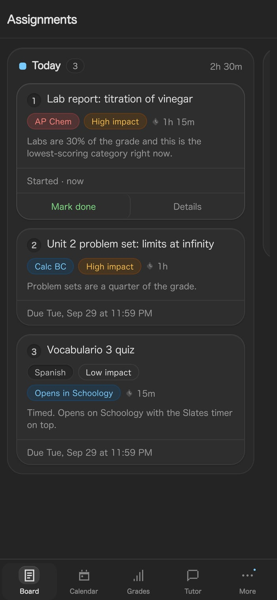
</td>
<td width="66%" valign="top">

The `mobile/` app is a Capacitor shell for iPhone and Android with its own phone layout: the board, calendar, grades, and tutor, one thumb away.

It loads the same portal running on your computer, so sync, submissions, messages, and the tutor keep working, and nothing about your school account moves onto the phone. Put Slates on an always-on PC and the phone stops needing your laptop at all ([here's how](docs/remote-host-setup.md)).

</td>
</tr>
</table>

<br>

## Being built

<div align="center">
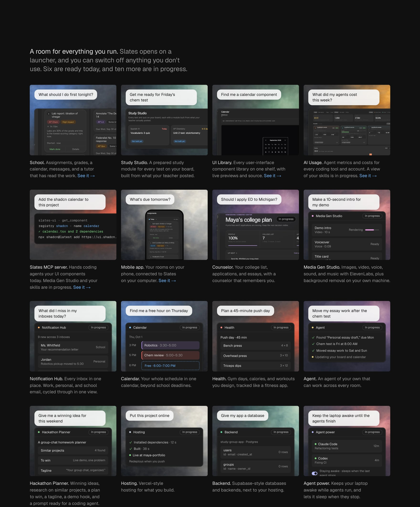
</div>

<br>

### Counselor 

An agentic college counselor, not a chat window with a prompt on it.

- **It reads a real library.** Point it at a folder of counseling guides and `npm run counselor:ingest` indexes them into `~/.slates/knowledge/`. Answers come from that first, cited by document name.
- **It researches what it can't know.** Deadlines, costs, and policies come from the web with the source named, never recalled from training data.
- **It remembers.** Goals, worries, budget, who's writing your letters. You can read everything it holds and delete any of it.
- **It has a verdict.** "Apply ED to Michigan." "Retake once, then stop." It doesn't hand you a balanced list and call it advice.
- **It reads every sentence of your essay.** The essay studio scores a draft against its rubric, then marks every sentence green, amber, or red, with steps for the ones that aren't working. It won't write your personal statement, and says why.
- **You can call it.** Voice goes peer-to-peer from your browser to OpenAI over WebRTC and never passes through Slates.
- **Odds as a range.** Each school's chances come as a band, never one falsely precise number.

<div align="center">
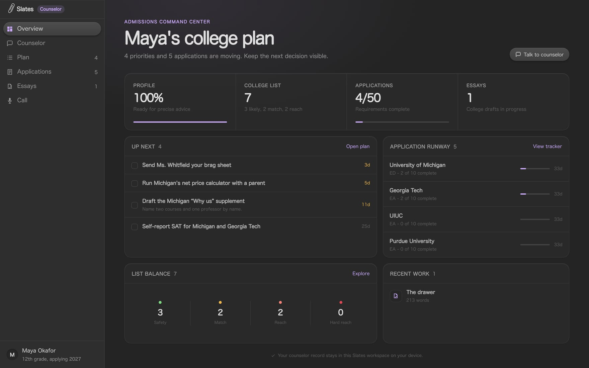
</div>

### And the rest

| Room | Where it's headed |
| --- | --- |
| **Media Gen Studio** | Images, video, voice, sound effects, and music through ElevenLabs, kept in a local library, with background removal that runs on your machine. Coding agents get the same tools through the Slates MCP server. |
| **Agent** | AI teammates that work on your PC: they use a browser, run routines, ask before anything risky, work together in group chats, and can answer out loud. |
| **Notification Hub** | Every inbox in one place, cycling through work, personal, and school email in one view. |
| **Calendar** | Your whole schedule, beyond school deadlines, so "find me a free hour on Thursday" has an answer. |
| **Hackathon Planner** | Winning ideas, research on similar projects, what it takes to win, a tagline and demo hook, and a prompt you can hand straight to a coding agent. |
| **Hosting and Backend** | Vercel-style hosting and Supabase-style databases for what you build, next to everything else. |
| **Agent power** | Keeps the laptop awake while agents are running, and lets it sleep when the last one stops. |
| **Skills** | See the skills you've given your agents in AI Usage, and serve them to any agent over MCP. |

<br>

## How it works

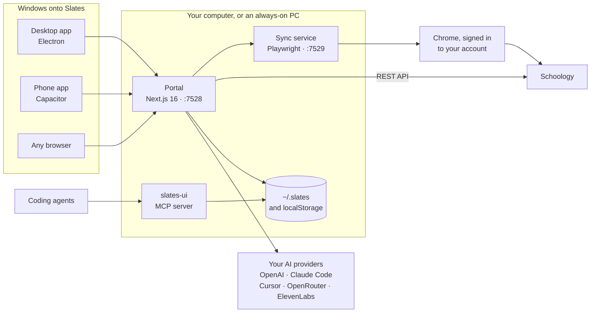
```mermaid
flowchart LR
  subgraph windows["Windows onto Slates"]
    desktop["Desktop app<br/>Electron"]
    phone["Phone app<br/>Capacitor"]
    browser["Any browser"]
  end

  subgraph host["Your computer, or an always-on PC"]
    portal["Portal<br/>Next.js 16 · :7528"]
    sync["Sync service<br/>Playwright · :7529"]
    data[("~/.slates<br/>and localStorage")]
    mcp["slates-ui<br/>MCP server"]
  end

  desktop --> portal
  phone --> portal
  browser --> portal
  portal --> sync
  portal -- "REST API" --> schoology["Schoology"]
  sync --> chrome["Chrome, signed in<br/>to your account"] --> schoology
  portal --> data
  portal --> ai["Your AI providers<br/>OpenAI · Claude Code<br/>Cursor · OpenRouter · ElevenLabs"]
  agents["Coding agents"] --> mcp --> data
```

- **Two ways into Schoology.** The portal reads classes, assignments, and grades through the Schoology REST API with your own key. A dedicated, signed-in Chrome profile, driven by Playwright, handles what the API can't: materials, submissions, messages, and assessments.
- **The portal holds no Schoology cookie.** It only ever talks to `localhost`. Every submission is checked against the page's own revision list afterward: a `200` from Schoology means nothing on its own, and a new revision means it landed.
- **One process tree.** The desktop app starts the portal and the sync service together. One icon, and quitting stops everything.
- **Local first.** Your record lives in `localStorage` and `~/.slates/`. There is no Slates account and no Slates server.

<br>

## Get started

### Download

| | |
| --- | --- |
| **macOS** (Apple silicon) | [Slates-0.1.0-arm64.dmg](https://github.com/smaranz/slates/releases/download/v0.1.0/Slates-0.1.0-arm64.dmg) |
| **Windows** | [Slates.Setup.0.1.0.exe](https://github.com/smaranz/slates/releases/download/v0.1.0/Slates.Setup.0.1.0.exe) |

The Mac app isn't notarized yet, so the first time, right-click Slates and choose **Open**. On Windows, SmartScreen warns about unsigned installers: choose **More info**, then **Run anyway**. The desktop app reads its keys from `~/.slates/.env`.

### Run from source

You'll need Node.js 22, Google Chrome, and a Schoology API key.

```bash
npm install -g github:smaranz/slates
slates                         # http://localhost:7528
```

Or clone it and run the two services yourself:

```bash
git clone https://github.com/smaranz/slates.git
cd slates/web
cp .env.example .env.local     # add your keys
npm install
npm run dev                    # http://localhost:7528

# in a second terminal: the sync service
cd slates/scraper
npm install
npx playwright install chromium
npm run login -- yourschool.schoology.com   # sign in once, SSO included
npm run serve                               # leave it running
```

The login opens a visible browser on a dedicated profile. You sign in to Schoology exactly as you normally would; Slates never reads or types your password.

### Connect Schoology

Generate an API key at `https://<your-district>.schoology.com/api`, then put both halves in `web/.env.local` (or `~/.slates/.env` for the desktop app and `slates host`):

```bash
SCHOOLOGY_KEY=...
SCHOOLOGY_SECRET=...
```

### Keys

Every key is optional on its own. Each feature says "not configured" until you add the key it needs.

| Variable | Unlocks |
| --- | --- |
| `SCHOOLOGY_KEY`, `SCHOOLOGY_SECRET` | Your classes, assignments, and grades |
| `OPENAI_API_KEY` | GPT tutor models, time estimates, and the counselor's typed and voice modes |
| `OPENROUTER_API_KEY` | DeepSeek, GLM, Qwen, Gemini, and MiniMax |
| `NEXT_PUBLIC_DESMOS_API_KEY` | Live, interactive graphs from the tutor |
| `ELEVENLABS_API_KEY` | Narrated lessons, tutor illustrations, and Media Gen Studio |
| Claude | `claude auth login`. No key lives in the env |
| Grok and Composer | `cd web && npm run cursor:login` |

The full, commented reference is [`web/.env.example`](web/.env.example).

<details>
<summary><b>Build the desktop app</b></summary>
<br>

```bash
cd desktop
npm install
npm run dev        # attaches to the portal you already started
npm run dist:mac   # packaged build for macOS (arm64)
npm run dist:win   # packaged build for Windows
```

Pushing a `v*` tag builds both installers in GitHub Actions and attaches them to a release ([`.github/workflows/release.yml`](.github/workflows/release.yml)).

</details>

<details>
<summary><b>Set up the phone app</b></summary>
<br>

```bash
cd web
npm run dev:mobile           # exposes the portal to your trusted network

cd ../mobile
npm install
cp .env.example .env         # the host computer's reachable URL
npm run check:server
npm run sync
npm run open:ios             # or: npm run open:android
```

The phone doesn't run the sync service. Keep the portal and sync service running on the computer it points at. Signing and device notes are in [`mobile/README.md`](mobile/README.md).

</details>

<details>
<summary><b>Run it on an always-on PC</b></summary>
<br>

The heavy part of Slates is the back end: the portal, the sync service and the Chrome it drives, and the Claude Code and Cursor processes a tutor reply spawns. Put all of it on a computer that stays on, and the laptop becomes a window.

```bash
slates host                  # the portal and sync service, served to your other devices
```

Both services listen on `127.0.0.1`, and [Tailscale Serve](https://tailscale.com/kb/1312/serve) is the only way in. Set `SLATES_HOST` in `~/.slates/.env` on the laptop and phone to point them at it. The full walkthrough, including a Windows host that starts at login, is in [`docs/remote-host-setup.md`](docs/remote-host-setup.md).

</details>

<details>
<summary><b>Optional extras</b></summary>
<br>

- **The counselor's library.** `cd web && npm run counselor:ingest -- ~/path/to/your/guides` indexes a folder of PDFs, Word documents, slides, spreadsheets, and Markdown into `~/.slates/knowledge/`. The library itself is never copied into this repo.
- **The essay AI check's detector.** `npm --prefix web run detector:install` installs a local model. Without it the check measures the prose with local statistics, and your essay is never sent to detector sites.
- **Narrated lesson videos.** Install ffmpeg and HyperFrames on the computer that runs the portal.

</details>

<br>

## Privacy

- **No account, no Slates cloud.** Everything Slates keeps lives on your computer, in `localStorage` and `~/.slates/`.
- **Your own Schoology account, and nobody else's.** Your API key and the sync service's signed-in profile stay on the machine that runs them.
- **AI goes where you send it.** Requests go to the provider you pick, on your own key or the Claude and Cursor plans you already pay for.
- **Voice never touches Slates.** Calls run peer-to-peer from your browser to OpenAI. Slates only mints the one-call key.
- **AI Usage reads local logs.** Nothing about your coding tools is uploaded.
- **Keys stay in files you control.** `web/.env.local` or `~/.slates/.env`, plus linked keys stored with owner-only permissions.

<br>

## Project layout

| Path | What lives there |
| --- | --- |
| [`web/`](web) | The Next.js 16 portal: every room, the API routes, the AI back ends, and the MCP server |
| [`scraper/`](scraper) | The sync service: a signed-in Playwright browser that reads and writes Schoology |
| [`desktop/`](desktop) | The Electron shell. One process tree, one dock icon, one quit |
| [`mobile/`](mobile) | The Capacitor app for iPhone and Android |
| [`bin/`](bin) | The `slates` CLI: `slates` starts the portal, `slates host` serves your other devices |
| [`detector/`](detector) | The optional local model behind the essay AI check |
| [`extension/`](extension) | An optional Chrome bridge for handing the sync service your session |
| [`docs/`](docs) | Longer guides, like running Slates on an always-on PC |

## Development

```bash
cd web
npx tsc --noEmit                 # type-check
npx eslint <paths>               # lint what you touched
npx tsx --test <file>.test.ts    # run a test file
npm run test:math                # or a suite: test:math, test:media, test:notifications
```

Working with a coding agent? Point it at [`web/AGENTS.md`](web/AGENTS.md) before it touches the portal: this is Next.js 16, and its conventions differ from what most models were trained on.

## Rules of the road

Slates reads and writes **your own** Schoology account, and nobody else's. PowerSchool's terms aren't friendly to automation, so keep it personal, single-account, and polite on the wire. Don't point it at an account that isn't yours.

<br>

<div align="center">


**Slates** · MIT licensed · © 2026 Smaran

Take it, fork it, make it yours.

</div>
